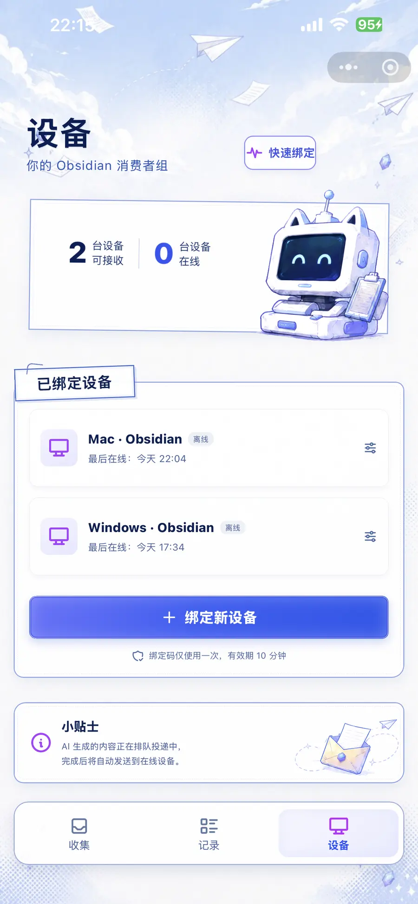
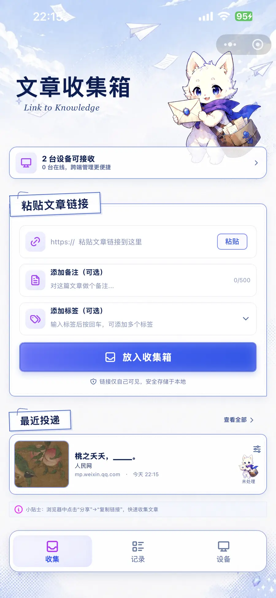
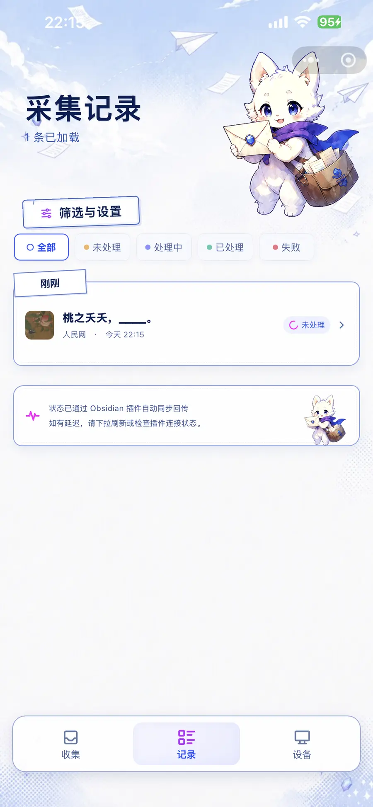
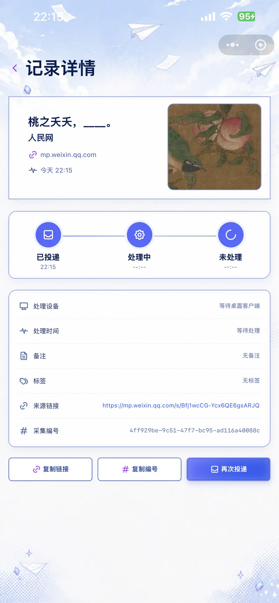
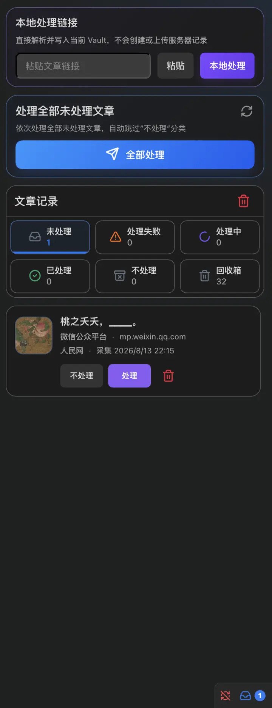
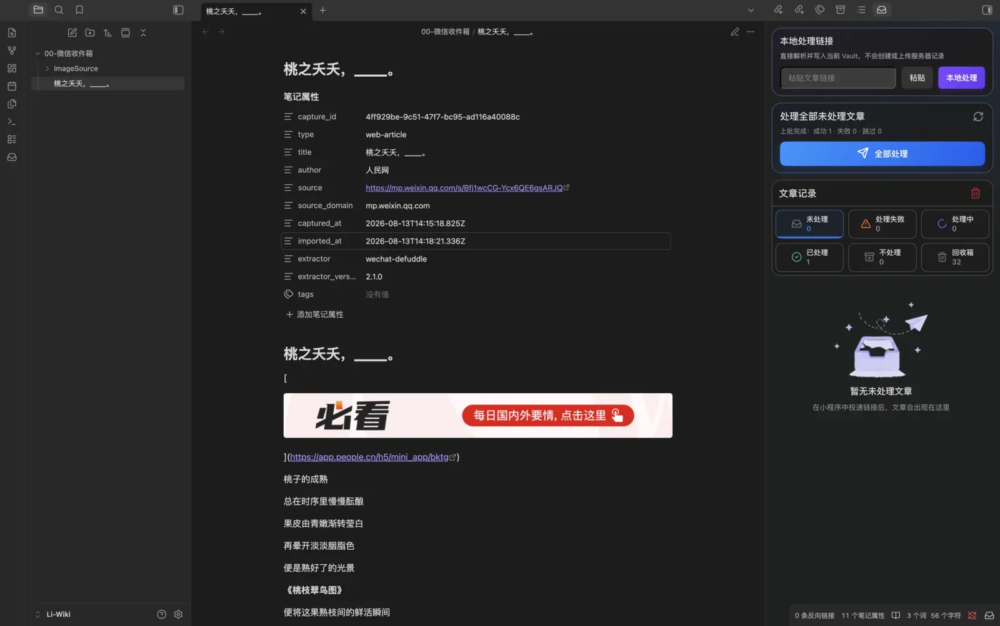

# WeChat Link Sync

**把微信里的文章链接送到 Obsidian，并在桌面端保存为本地 Markdown。**

WeChat Link Sync is an Obsidian desktop plugin that receives article links from the companion WeChat Mini Program **“同步链接”**, extracts the article on your computer, and saves it to your local vault as Markdown.

[中文](#中文说明) · [English](#english)

> [!IMPORTANT]
> WeChat Link Sync 必须配合微信小程序 **“同步链接”** 使用。小程序负责投递链接，Obsidian 插件负责在桌面端解析和保存文章。

## 中文说明

### 功能

- 在微信小程序“同步链接”中投递文章链接，可附加备注和标签。
- 在 Obsidian 侧边栏查看未处理、处理中、已处理、失败、不处理和回收箱记录。
- 手动处理单篇文章，或批量处理全部未处理文章。
- 将正文、文章信息和图片保存到当前 Vault，不自动上传文章正文。
- 也可以直接在插件中粘贴链接并本地处理，不创建云端投递记录。

### 支持的链接来源

| 类型 | 支持情况 |
| --- | --- |
| 微信公众号文章（`mp.weixin.qq.com`） | 专项适配 |
| 微博正文与长文 | 专项适配 |
| 小红书公开笔记 | 专项适配 |
| 豆瓣公开长评 | 专项适配 |
| 其他公开文章网页 | 通用解析，包括知乎专栏、掘金等常见正文页面 |

网页必须能在桌面网络环境中公开访问。需要登录、存在验证码、强反爬、地区限制或完全依赖动态脚本的页面，可能无法解析；网站改版也可能暂时影响兼容性。

### 使用方法

#### 1. 安装并启用插件

在 Obsidian 中打开“设置 → 第三方插件”，安装并启用 **WeChat Link Sync**。在插件选项中可以设置文章目录、图片保存方式和提醒方式。

当前版本仅支持 Obsidian 桌面端（Windows 与 macOS）。在正式进入社区插件库前，可以从 [Releases](https://github.com/codezelee/wechat-link-sync/releases/latest) 下载 `wechat-link-sync-<版本号>.zip`。解压后，将包含 `main.js`、`manifest.json` 和 `styles.css` 的文件夹放入：

```text
<Vault>/.obsidian/plugins/wechat-link-sync/
```

#### 2. 绑定微信小程序“同步链接”

在微信中打开小程序 **“同步链接”**，进入“设备”，点击“绑定新设备”生成一次性绑定码。然后进入 Obsidian 的“WeChat Link Sync → 选项”，输入该绑定码完成绑定。绑定码仅可使用一次，有效期 10 分钟。

<p align="center">
  
</p>

#### 3. 投递文章链接

在手机浏览器或微信中复制文章链接，粘贴到小程序“收集”页；按需填写备注和标签，然后点击“放入收集箱”。

<p align="center">
  
</p>

#### 4. 查看投递状态

“记录”页展示文章当前状态。打开记录详情可以查看来源链接、备注、标签、处理设备和处理时间，也可以重新投递。

<p align="center">
  
  &nbsp;
  
</p>

#### 5. 在 Obsidian 中处理文章

打开左侧功能区的收件箱图标。在未处理记录上点击“处理”，或点击“全部处理”。插件会在桌面端获取网页、转换为 Markdown，并下载可用图片。

<p align="center">
  
</p>

#### 6. 获得本地 Markdown 笔记

处理成功后，文章会写入设置的 Vault 目录；图片统一保存在该目录下的 `ImageSource` 文件夹中。笔记包含来源链接、作者、采集时间等属性。



### 网络与隐私

- 小程序投递的原始链接、备注、标签和处理状态会通过 WeChat Link Sync 服务在已绑定设备间同步。
- 插件会连接 `https://api.bigpro.cn` 完成设备绑定、获取链接队列和回传处理状态。
- 文章正文由 Obsidian 桌面插件从来源网站获取、解析并写入本地 Vault；插件不会把提取后的文章正文上传到 WeChat Link Sync 服务。
- 插件使用 Obsidian `SecretStorage` 保存设备令牌；普通插件设置中不会写入明文令牌，设置页也只显示星号。解除绑定后，服务器会立即使该令牌失效。诊断导出不会包含令牌、正文或 Vault 内容。
- “本地处理链接”功能直接访问来源网页并写入当前 Vault，不创建服务器投递记录。

详见 [PRIVACY.md](PRIVACY.md)。

### 开源范围

这个公开仓库只包含运行和审核 Obsidian 插件所必需的源码、最小客户端协议类型、构建配置和文档。微信小程序、服务端、数据库结构及部署配置不在本仓库中。

## English

### What it does

WeChat Link Sync connects Obsidian Desktop with the companion WeChat Mini Program **“同步链接”**:

1. Copy an article URL on your phone.
2. Paste it into the “同步链接” Mini Program, optionally adding a note and tags.
3. Open WeChat Link Sync in Obsidian and process one item or the entire pending queue.
4. The plugin fetches and converts the article on your computer, downloads available images, and writes a local Markdown note to your vault.

The Mini Program is required for cross-device delivery. You can also paste a URL directly into the plugin for a local-only import.

### Supported sources

- WeChat Official Account articles (`mp.weixin.qq.com`)
- Weibo posts and long-form posts
- Public Xiaohongshu notes
- Public Douban reviews
- Other publicly accessible article pages through the generic extractor, including common Zhihu Column and Juejin pages

Pages behind a login, CAPTCHA, aggressive anti-bot protection, regional restriction, or client-only rendering may not work. Website changes can temporarily affect extraction.

### Setup

1. Install and enable **WeChat Link Sync** in Obsidian Desktop.
2. Open “同步链接” in WeChat and go to **设备 / Devices**.
3. Generate a one-time binding code with **绑定新设备**.
4. In Obsidian, open **Settings → WeChat Link Sync → Options**, enter the six-digit code, and bind the desktop device.
5. Submit a link in the Mini Program, then process it from the WeChat Link Sync sidebar in Obsidian.

The screenshots in the [Chinese walkthrough](#使用方法) show the complete collection, device binding, status, processing, and local-note workflow.

### Data and repository scope

The service synchronizes submitted URLs, optional notes and tags, device information, and processing status. Article content is fetched and converted by the desktop plugin and written to the local vault; extracted article bodies are not uploaded to the WeChat Link Sync service. Device tokens are stored through Obsidian `SecretStorage`, are masked in settings, and are revoked by the server when the device is unbound. See [PRIVACY.md](PRIVACY.md) for details.

This public repository contains only the Obsidian plugin, the minimum client protocol types required to build it, and its documentation. The WeChat Mini Program, backend implementation, database schema, and deployment configuration are not included.

## Development

Requirements: Node.js 22 or newer and npm.

```bash
npm ci
npm run verify
```

The production build creates `main.js`. A valid Obsidian release contains these individual assets:

- `main.js`
- `manifest.json`
- `styles.css`

The release tag must exactly match the version in `manifest.json`, without a `v` prefix.

## License

[MIT](LICENSE) © 2026 codezelee
